# ZweeNotes architecture

## Product boundary

NUS-first Chrome extension: organize the user's Canvas materials, derive reusable knowledge points with their Qwen API account, and compose an editable one-page revision sheet. Course structure comes from Canvas. Activity type (lecture/tutorial/lab/reference) is independent of source format (Canvas text/PDF/notes/transcript). A tutorial or lab never needs a video to belong in the library.

The original style is inspired by the dense multi-column revision sheets commonly shared by NUS students: A4 landscape, four columns, serif body text, compact sans-serif topic headings, thin separators, equations, methods, pitfalls and small source markers. This is not an official NUS or Studocu template. No Studocu document content or branding is copied.

```mermaid
flowchart LR
  Canvas["Canvas: course context + module links"] --> Panel["Side panel: capture / import"]
  Files["PDF / TXT / MD / VTT / SRT"] --> Parse["Local parsers + page / cue locators"]
  Panel --> Parse
  Parse --> Library["IndexedDB course library"]
  Library --> Job["Studio tab: resumable chunk job"]
  Key["Session-only Qwen key"] --> Job
  Job --> Qwen["Alibaba Model Studio API"]
  Qwen --> Validate["Validate JSON + supplied reference IDs"]
  Validate --> Atoms["Knowledge points + provenance + review flag"]
  Atoms --> Select["Scope / emphasis / trouble topics / budget"]
  Select --> Editor["Editable revision blocks"]
  Editor --> Layout["Fixed A4 geometry + overflow detection"]
  Layout --> Print["Chrome print / Save as PDF"]
  Atoms --> Library
  Editor --> Library
```

## Runtime responsibilities

| Component | Responsibility |
| --- | --- |
| `scripts/canvas-context.js` | Read visible context; capture selected study text on request; read the current course's module directory on an explicit sync |
| `scripts/viewer-content.js` | Preserve Panopto downloader and open study panel |
| `scripts/background.js` | Per-tab session context, panel opening and Chrome downloads; no long AI job |
| `sidepanel.*` | Course-aware capture, local file/notes import, module directory and Studio launch |
| `scripts/importers.js` | PDF text extraction using bundled PDF.js; page and transcript-cue locators |
| `scripts/core.js` | Course source normalization, bounded chunks, extractive notes, point ranking and sheet schema |
| `scripts/storage.js` | IndexedDB persistence of courses, sources, chunk results and sheets |
| `scripts/qwen.js` | Restricted official endpoints, session credentials, JSON request and response validation |
| `scripts/pipeline.js` | Sequential chunk generation, durable successful results, cancellation and resume |
| `studio.*` | Source scope, knowledge browsing, review, editing, personal trouble topics, page layout and print |
| `scripts/render.js` | Safe text/code/table rendering and bundled KaTeX math; no raw HTML execution |
| `options.*` | User-entered key/model/region configuration and exact-origin permission request |

## Data contracts

- **Course**: `id = nus:{CanvasCourseId}` (or UUID for manually created courses), `name`, `canvasId`, `modules`, `outlineUpdatedAt`, `troubleTopics`. Course names, weeks and topics are never hardcoded to one student's enrollment. Data belongs to the Chrome extension profile; use separate Chrome profiles for different people.
- **Source**: UUID, `courseId`, `revision`, `title`, `format`, `activity`, optional `week`, sanitized Canvas URL, `segments[]`. Each segment carries an ID and a page/section/timestamp locator.
- **Knowledge point**: UUID, `sourceId`, `kind`, `title`, `summary`, `details`, priority 1–3, `references[]`, engine and `needsReview`. Types: concept/formula/algorithm/pattern/pitfall. Source IDs are validated against the actual request; this checks provenance structure, not factual correctness.
- **Chunk result**: course/source IDs, successful atoms and creation time. Cache key includes schema version, source ID/revision, chunk number, Qwen endpoint and model. Credentials are never part of a cache record. A cached result is reused even if a new key is entered for the same model and source.
- **Sheet**: course ID, title, source index, all selected editable blocks, omitted count, page geometry and timestamps. Blocks can contain a user-added local raster diagram. Edits and review flags apply to that sheet; cached AI knowledge remains the original extraction.

Source content is immutable after import. Reimport revised material to create a new revision. Scope is selected sources: one lecture, a week, or a course. Trouble topics receive highest rank, then source coverage and priority/emphasis. If the point budget is smaller than the number of sources or trouble points, full coverage cannot be guaranteed. Identical title/body candidates are deduplicated. The knowledge browser exposes unselected points instead of discarding them.

## Canvas integration

Course detection uses the current URL and visible breadcrumb/title. Explicit module sync performs read-only GETs from the Canvas tab with its existing first-party login. It follows pagination and falls back to the module-items API when inline items are omitted. It accepts only the same course's module endpoints and stores titles/types/item links, not grades or submission data. API errors preserve the existing local directory. Open an item to capture text or import its downloaded file; there is no automatic bulk course download. Module directories may be empty or disabled on particular courses.

Capture imports a selection or the current `.user_content` study container. It does not crawl hidden course data, other students' replies, submissions or quizzes automatically. Panopto is supplementary recording context and an existing download route. VTT/SRT transcripts must currently be supplied by the user; automatic caption retrieval and video transcription are future work.

## Qwen jobs and credentials

Qwen is the default summarizer. The user enters their own key in settings, chooses a matching model/region, and grants host access from an explicit click. The request goes directly to an allowlisted official Alibaba endpoint with `credentials: omit` and redirects rejected. No ZweeNotes backend, account, analytics or provider key is shipped.

Only `chrome.storage.session` stores the key; the default trusted-context access level is kept. Model and base URL persist without the key. Source text, course/material title, activity and locators are sent only when generating with Qwen. Region/account terms and API billing belong to the user's Alibaba account. Diagrams are local and are not sent to the text model.

Jobs run in a full extension tab so an MV3 worker timeout does not terminate long processing. Keep Studio open during generation. Each request has a 90-second timeout, input chunks are approximately 11,000 characters, and a run is limited to 80 chunks. Successful chunks commit before the next request. Failure/cancellation can be resumed by selecting the same sources/model; failed chunks are requested again. No automatic paid retries. Concurrent Studio tabs may duplicate in-flight requests; use one Studio editor per course. Closing a tab cannot commit an unfinished request.

The model receives source text as untrusted reference data and is asked for JSON with only supplied segment IDs. Runtime validation rejects invalid structures, unknown references and truncated responses. All AI points start as needing review. Source snippets are available for human comparison. A valid citation cannot guarantee an accurate summary, formula or inferred method.

## One-page rendering

Default: 297 × 210 mm, four columns, 5 mm inset, 7.5 pt body. Portrait, 3–5 columns, 6–12 pt body and 3–12 mm inset are configurable. Screen preview zoom is separate from physical print size. KaTeX, PDF workers, fonts and assets are bundled locally for the extension CSP.

The column region has a fixed height and is measured for horizontal spill, oversized blocks/equations and page overflow. Fit reduces font size in 0.25 pt steps to a 6 pt floor. It does not drop or hide included points. The normal print action is disabled while overflowing; the browser's direct print command shows a warning page in that state. Exclude/shorten content or adjust the layout to resolve overflow. Chrome's print settings must match A4 orientation, 100% scale, no margins or browser headers. Printer/PDF driver output still needs a visual check.

## Persistence and limits

Materials, original diagrams, chunk results and sheets stay in IndexedDB until deleted or the extension/profile storage is cleared. Session context and keys expire with the browser session. Deleting a source also removes its cached points; existing sheets retain text and source labels but lose access to the original evidence text. Export Project creates a JSON archive with course materials, knowledge and sheets, never credentials. Automatic archive restore is not implemented yet. Keep exported materials private.

Import limits: 20 MB per file, 300 PDF pages, 350,000 extracted characters per material; diagrams 1 MB and 4000 pixels per dimension. PDF text order follows the document's text items and may need correction for complex columns or equations. Image-only scans need OCR outside this version. Slides must be exported as PDF. Audio/video, OCR, native PowerPoint parsing and managed account/billing are not implemented.

## Expansion path

1. Live NUS course feedback: module identity → lecture workspace; selected Canvas file import; authorized Panopto caption connector; archive import/migration; persistent edits to canonical knowledge points.
2. Higher-fidelity materials: slide images + OCR/math parsing, multimodal figure extraction, small topic dependency graphs.
3. Optional cloud service: authenticated tenant-scoped jobs, secret storage, per-user budgets, object storage, progress events and deletion controls. Transcription/OCR jobs run on durable backend workers, never in the MV3 service worker. BYOK direct mode can remain available.
4. Other institutions: separate LMS adapters returning the same course/module/source contract; include institution/tenant identity in every course key. Layout and knowledge generation remain shared.

## References

- [Canvas modules API](https://developerdocs.instructure.com/services/canvas/resources/modules): read-only module and item discovery.
- [Alibaba Model Studio regions](https://www.alibabacloud.com/help/en/model-studio/regions/) and [compatible base URLs](https://help.aliyun.com/en/model-studio/base-url): matching workspace/region endpoints.
- [Qwen structured output](https://www.alibabacloud.com/help/en/model-studio/qwen-structured-output): JSON-mode contract.
- [PDF.js examples](https://mozilla.github.io/pdf.js/examples/) and [KaTeX options](https://katex.org/docs/options): local parsing and safe formula rendering.
- [Public NUS cheatsheet example on Studocu](https://www.studocu.com/sg/document/national-university-of-singapore/introduction-to-operating-systems/cs2106-cheatsheet-final-cheat-sheet/40386876): visual/product reference only; its text is not included.
